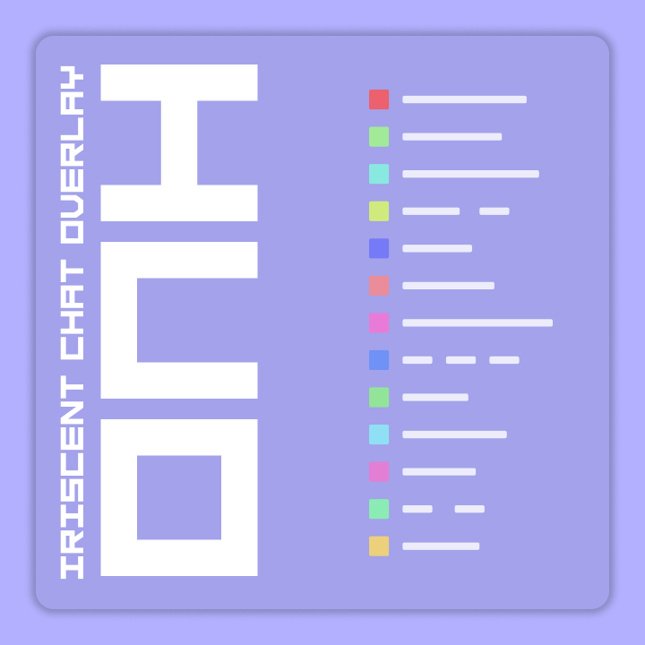

# 

  
  

## Screenshots

> Chat Comparison 
---
> Main Menu 
---
> Transparent Window 

## Features

- Emote Support (7TV, BetterTTV, FrankerFaceZ)
- Events in chat (Follows, Gifted Subs, Bits etc.)
- Badges
- Customizable
- Open Source
- Top Most window mode (i mean this is pretty much the point of it but i mean it is a feature soooo)
- Somewhat frequent updates :) (no autoupdater tho 😭)
- Transparent window support
- Discord Rich Presence
- `Custom Plugins and Styles support (SOON)`

## Contributing

man idk why anybody would want to but like just do whatever you want like srsly i don't care enough

## Building

nah dont even try 💀

## Credits

[BattlePrizrak](https://twitch.tv/battleprizrak) - helped in event support testing :)  
[balkticu](https://twitch.tv/balkticu) - idk why this man is here dont even ask, i guess emotional support or something  
[me](https://twitch.tv/felixfromdiscord) - i mean i created this thing btw pls follow my twitch i will stream soon i promise :(  
[(king)kaizen](https://twitch.tv/king_kaizen_) - emotional support :)  
generous anon - the new logos  
